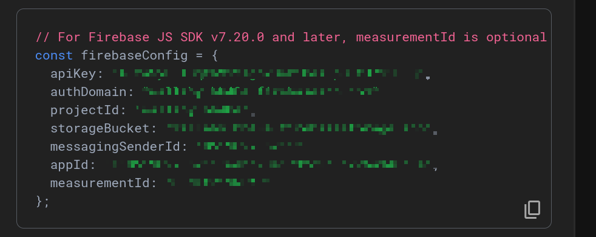
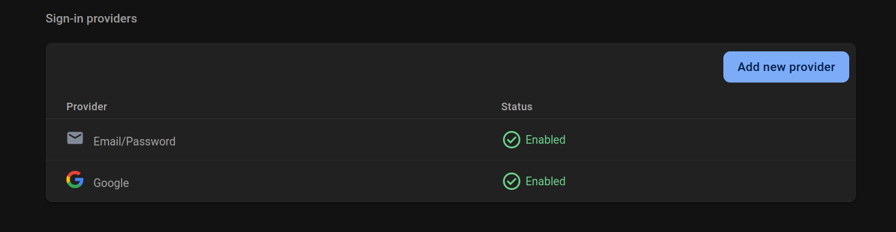

# Spring Stateless Authentication

This project demonstrates JWT-based stateless authentication using Firebase for identity management and Vue.js for the frontend client.

The Spring boot backend functions as a resource server and validates the JWT token with Firebase. 

## Getting Started

This project uses Maven to build and install the frontend and backend dependencies. Manual installation is not required!

### 1. Create a file called `firebase.env`

In this file, add the following environment variables. These values can be found in the Firebase console:

- Navigate to **Project Overview → Settings → General → Your Apps**.
- If you haven't already added an app, click the **"Add App"** button to create a new web app.
- After creation, the following values will be visible and can be added in the format below to the `.env` file.



Add them in the following format. Vite will automatically process these variables and make them available in the frontend.
```
VITE_FIREBASE_API_KEY=<REPLACE ME>
VITE_FIREBASE_AUTH_DOMAIN=<REPLACE ME>
VITE_FIREBASE_PROJECT_ID=<REPLACE ME>
VITE_FIREBASE_STORAGE_BUCKET=<REPLACE ME>
VITE_FIREBASE_MESSAGING_SENDER_ID=<REPLACE ME>
VITE_FIREBASE_APP_ID=<REPLACE ME>
VITE_FIREBASE_MEASUREMENT_ID=<REPLACE ME>
```

### 2. Run the Frontend and Backend

Use the bash script to start the UI and service

```shell
./run.sh
```

The Spring boot service should stop when exiting the script.

### 3. (Optional) Enable "Sign-in with Google"

This requires you to enable the Google provider on your Firebase account.

Navigate to the Authentication section in Firebase console and click "Add New Provider"
Select "Google"



### References

- [Firebase Authentication Documentation](https://firebase.google.com/docs/auth)
- [JWT.io](https://jwt.io/)
- [Vue.js Documentation](https://vuejs.org/)
- [Spring Boot Documentation](https://spring.io/projects/spring-boot)


# Tags

`vue` `vue.js` `firebase` `authentication` `jwt` `token` `stateless-auth` `spring-boot` `spring-security` `oauth2` 
