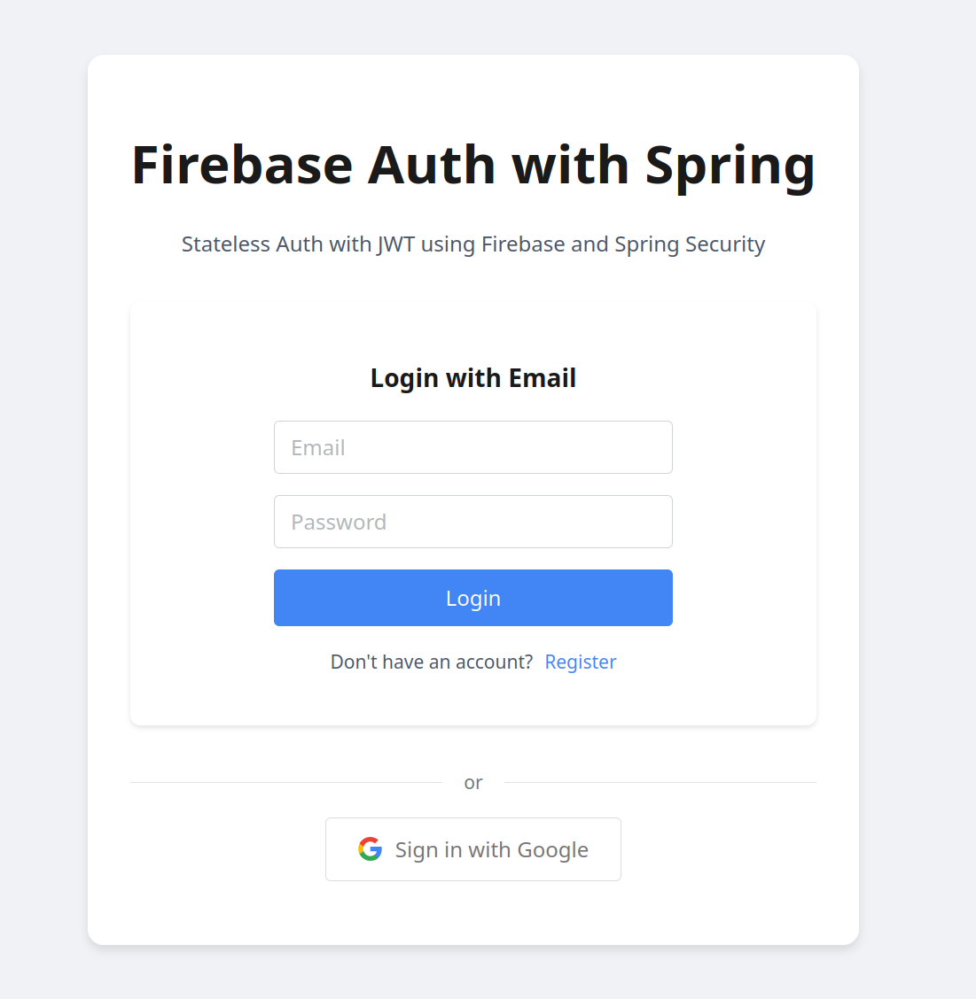
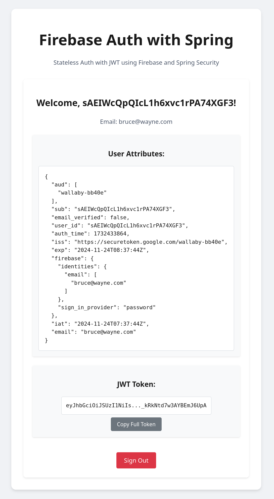
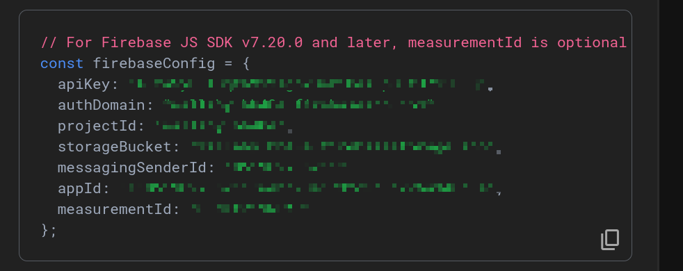
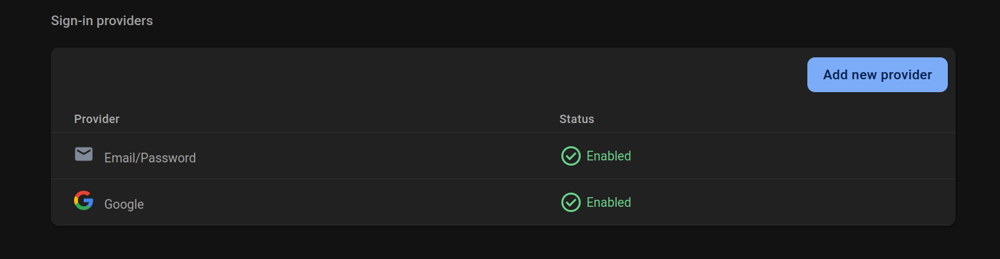

# Spring Stateless Authentication

This project demonstrates JWT-based stateless authentication using Firebase for identity management and Vue.js for the frontend client.

The Spring boot backend functions as a resource server and validates the JWT token with Firebase. 




## Getting Started

This project uses Maven to build and install the frontend and backend dependencies. Manual installation is not required!

### 1. Create a file called `firebase.env`

In this file, add the following environment variables. These values can be found in the Firebase console:

- Navigate to **Project Overview → Settings → General → Your Apps**.
- If you haven't already added an app, click the **"Add App"** button to create a new web app.
- After creation, the following values will be visible and can be added in the format below to the `.env` file.



Add them in the following format. Vite will automatically process these variables and make them available in the frontend.
```
VITE_FIREBASE_API_KEY=<REPLACE ME>
VITE_FIREBASE_AUTH_DOMAIN=<REPLACE ME>
VITE_FIREBASE_PROJECT_ID=<REPLACE ME>
VITE_FIREBASE_STORAGE_BUCKET=<REPLACE ME>
VITE_FIREBASE_MESSAGING_SENDER_ID=<REPLACE ME>
VITE_FIREBASE_APP_ID=<REPLACE ME>
VITE_FIREBASE_MEASUREMENT_ID=<REPLACE ME>
```

### 2. Run the Frontend and Backend

Use the bash script to start the UI and service

```shell
./run.sh
```

The Spring boot service should stop when exiting the script.

### 3. (Optional) Enable "Sign-in with Google"

This requires you to enable the Google provider on your Firebase account.

Navigate to the Authentication section in Firebase console and click "Add New Provider"
Select "Google"



### Notes

In the Spring boot service, the `/user` endpoint makes use of the `JwtAuthenticationToken` object, which is part of the Spring Security OAuth2 resource server configuration [application.yml](src/main/resources/application.yml)

This configuration allows your service to validate and process incoming JWT tokens, typically issued by an OAuth2 authorization server like Firebase. 

In this case, the JWT token is validated against the JSON Web Key Set (JWKS) URI provided by Firebase and the issuer URI, as configured in the Spring Security configuration.

Using `JwtAuthenticationToken` is particularly useful when working with JWT-based authentication, as it provides richer information about the authenticated user. 

Compared to the `Principal` or `Authentication` objects, which contain limited details, `JwtAuthenticationToken` exposes the token’s claims and user attributes, making it more convenient for accessing user information in the endpoint.

While alternatives like `OAuth2User` or `OAuth2AuthenticationToken` are also available, they are typically used in OAuth2 flows that involve third-party login providers (such as Google or Facebook). 

These alternatives would require additional configuration, such as implementing a custom provider and adding it to the Spring Security filter chain. 

However, this setup goes beyond the scope of this demo, which focuses on JWT-based stateless authentication, leveraging Firebase as the authorization source.

### References

- [Firebase Authentication Documentation](https://firebase.google.com/docs/auth)
- [JWT.io](https://jwt.io/)
- [Vue.js Documentation](https://vuejs.org/)
- [Spring Boot Documentation](https://spring.io/projects/spring-boot)
- [Spring Security API Authentication Firebase @Medium](https://medium.com/@purikunal22/securing-springboot-api-using-firebase-authentication-16d72dd250cc)
- [Spring Security Auth with Firebase @Medium](https://medium.com/comsystoreply/authentication-with-firebase-auth-and-spring-security-fcb2c1dc96d)
- [Spring Security Oauth2 Docs](https://docs.spring.io/spring-security/reference/servlet/oauth2/resource-server/jwt.html)

# Tags

`vue` `vue.js` `firebase` `authentication` `jwt` `token` `stateless-auth` `spring-boot` `spring-security` `oauth2` 
